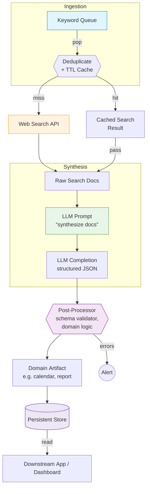

### Re‑usable Pattern & Cross‑domain Use‑cases

The architecture is domain‑agnostic: **“keyword → web search → LLM synthesis → post‑processing”**. Swap the keyword list & post‑processor and you get a new product. Examples:

| Domain | Keyword Source | LLM Synthesis Goal | Post‑processor / Output |
|--------|----------------|--------------------|-------------------------|
| **Security Threat Intel** | CVE‑IDs, malware names | Consolidate advisories, exploits, patches | Risk‑score timeline & patch calendar |
| **Academic Literature** | DOI list, research topics | Summarise latest papers, compare findings | Structured literature review & reading list |
| **Product Price Monitoring** | SKU codes | Aggregate retailer prices, promotions | Daily price‑change dashboard |
| **SEO Content Planning** | SERP keywords from Google Search Console | Extract questions, gaps, trends | Editorial calendar with topic briefs |
| **Clinical Guideline Updates** | Disease names, drug names | Collate new trials, FDA alerts | Change‑log & physician alert newsletter |
| **Legal Case Tracking** | Court docket numbers | Summarise filings, rulings, dates | Litigation timeline & deadline calendar |
| **Supply‑chain Watch** | Commodity codes, port names | Gather freight news, disruptions | Alert feed & ETA planner |
| **Grant/Funding Scout** | STEM topics, agency names | Capture new CFPs, deadlines | Funding‑opportunity calendar |
| **Talent Sourcing** | Tech skills, role titles | Aggregate candidate signals from forums, GitHub | Ranked lead list & outreach schedule |

Because the workflow is asynchronous, cached, and DB‑backed, you can scale horizontally by:

* **Extending `ApiToolFactory`** – add custom scrapers or internal APIs instead of only web search.  
* **Plug‑in new prompts** – tailor `combine_scrape_*`, `analyze_data`, `create_calendar` for each vertical.  
* **Swap storage** – move from SQLite to Postgres; viewer to Streamlit, etc.

---

### Key Take‑aways for Adapting

* **Keyword abstraction** is the only domain‑specific part early in the pipeline.  
* **Prompt files** isolate LLM behaviour; editing them avoids code changes.  
* **Cache ≈ rate‑limit shield** – indispensable when expanding to thousands of keywords.  
* **Mermaid visualisation** helps non‑engineers grasp the flow; include it in docs.  
* **DB schema** (users → summaries → calendars) is generic; reuse for any iterative enrichment chain.

---

### Architecture‑centric Mermaid Diagram  

---

### Implementation Caveats & Mitigations  

| Layer | Typical Pitfall | Mitigation Strategies |
|-------|-----------------|-----------------------|
| **Keyword Queue** | ▸ Flood of near‑duplicate terms increases cost ▸ Stale keywords linger | • Normalise & fuzzy‑dedupe before enqueue • Add *time‑to‑live* so old items expire |
| **Cache / Storage** | ▸ Writing from many async workers → DB‑lock contention (SQLite) ▸ Schema changes break historical records | • Use Postgres/MySQL for concurrent writes • Migrate with tools like Alembic; keep *version* column in JSON payload |
| **Web Search API** | ▸ Rate‑limits & CAPTCHAs ▸ Regional blocking / GDPR constraints | • Rotate keys/providers; exponential back‑off • Allow pluggable “search‑adapter” interface |
| **LLM Synthesis** | ▸ Hallucinated facts ▸ Large token bills on verbose docs | • Force LLM to cite snippets with inline sources • Pre‑shrink docs (BM25, sentence‑rank) before prompt |
| **Post‑Processor** | ▸ JSON schema violations crash pipeline ▸ Prompt drift causes field mismatch | • Run strict validator (e.g., `pydantic`) and auto‑repair • Unit‑test prompt templates; lock with semantic‑versioning |
| **Persistence Layer** | ▸ Unbounded growth → pricey storage ▸ GDPR “right‑to‑forget” requests | • TTL partitions, archive cold data to S3 • Maintain deletion index by user identifier |
| **Down‑stream Apps** | ▸ Reading half‑written rows (no transaction isolation) ▸ Time‑zone confusion in calendars | • Use *serialization* isolation or write‑ahead flag • Store timestamps in UTC, render local in UI |

---

### Why the Pattern Scales Across Domains  

1. **Interchangeable Keyword Sources** – CVE IDs, SKUs, docket numbers… all reduce to *tokens to search*.  
2. **Stateless Web Search** – Provider‑agnostic; swap Google/Brave/Elastic internal index.  
3. **LLM as Universal Synthesizer** – Same engine can summarise exploits *or* strawberry prices; only the *prompt* changes.  
4. **Post‑Processor Hooks** – Drop‑in validators convert the generic JSON into domain‑specific artifacts (risk matrix, price dashboard, litigation timeline).  
5. **Shared Infrastructure** – Caching, rate‑limit handling, persistence, alerting are domain‑neutral; build once, reuse everywhere.

Feel free to ask for more granular design notes—e.g., sharding the keyword queue, evaluating embeddings for deduplication, or live‑stream updates with server‑sent events.